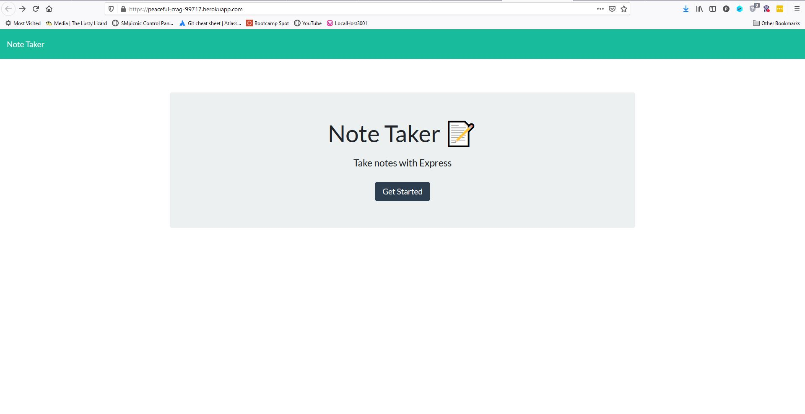

# Note Manager
No Badges

##### Table of Contents:
[Description](#description)  
[Installation](#install)  
[Usage](#usage)  
[Contact](#contact)  
[Email](#email)  
[Additional Info](#addContact)  
[Tests](#tests)  
[Github](#github)  
[License Notice](#license)  
[Contributors](#contributors)  

## Description

This project aims to make managing notes to yourself or general todo lists easier to manage. I features a server with a smooth and intuitive UI.

## Installation

Step 1: Clone this repo in desired directory

Step 2: Install node.js

Step 3: Run npm install express

Step 4: Run npm install

Step 5: If you are launching server locally, run npm start. Otherwise, go to the heroku link.

## Usage 

When you arrive on the landing page, you will see a brief desciption of the website as well as a get started button. When you click the button, the page will redirect you to another page housing the main features of the site. There are 2 areas where you can enter both a title and description of the note. Afterwards you will press the square-like save icon. If you wish to create or overwrite what is currently inside those areas, you can press the pensil icon. Once save is pressed, a note will appear on the left hand side of the page displaying the title of the note you saved. They may stack and duplicates are allowed. When you press on the text of one of those notes, the 2 fields will be populates with that notes title and description, editing is not allowed yet. When you want to delete a note you may press the trash can icon next to it.

## Contact

### Email
brandon.shoemaker2080@gmail.com

### Additional instructions on contacting me

  
  There are no additional instructions provided on how to obtain contact with the creator of this program.
  

  ## Tests

  There are no tests available for this program.
  

## Github Profile

https://github.com/BrandonShoemaker

## Heroku Link

https://peaceful-crag-99717.herokuapp.com/

## Screenshots

## License Notice

There is no license on this program.
    

## Contributors

Brandon Shoemaker: server functions and routes, Xandromus: HTML/CSS/Webpage Functions(js)

